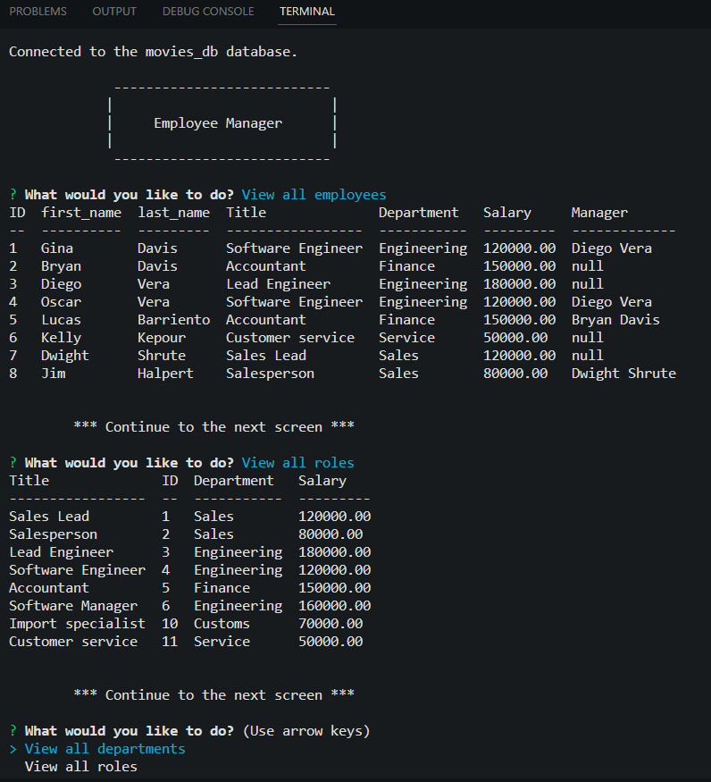

# Employee Tracker

# Description

This is a command-line application that manages a company's employee database using Node.js, Inquirer, and MySQL. I was motivated to practice my SQL skills while also practicing Node.js and learning more about async functions and promises.

# Table of Contents

- [Installation](#installation)
- [Usage](#usage)
- [Credits](#credits)
- [Contributing](#contributing)
- [Tests](#tests)
- [Questions](#questions)
- [License](#license)

# Installation
It is necessary to install inquirer and node.js

# Usage

This application is run from the terminal in a command-line application.

Link to the walkthrough video that demonstrates the functionality of the README generator [Click here to watch the video](https://drive.google.com/file/d/1aTD0u971Nic2wWYyTswJWGzdkmmq4hN4/view)

# Credits
- 
- 

# Contributing
Please email me if you want to contribute to my work.

# Tests
I tested this application using the console.log and also the try catch to get the errors.

# Questions
Link to my github profile [Github](https://github.com/ginitadavis/)
If you have any questions, you can reach me via email at gina.vera.davis@gmail.com

# License

